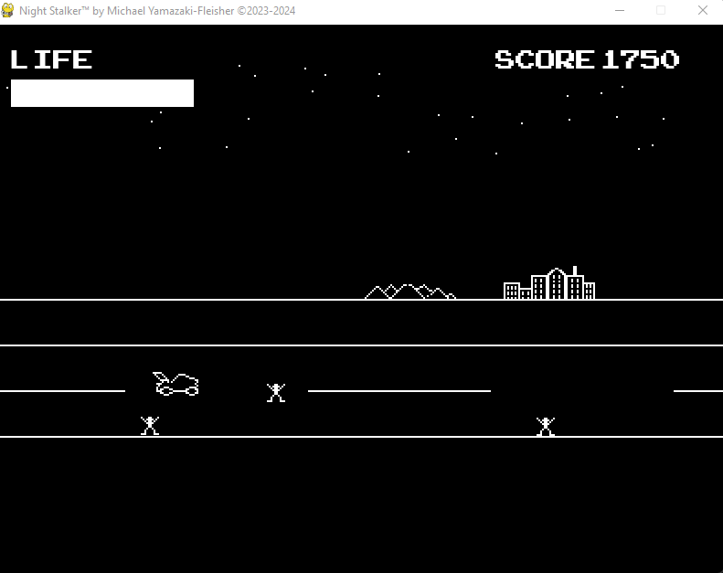
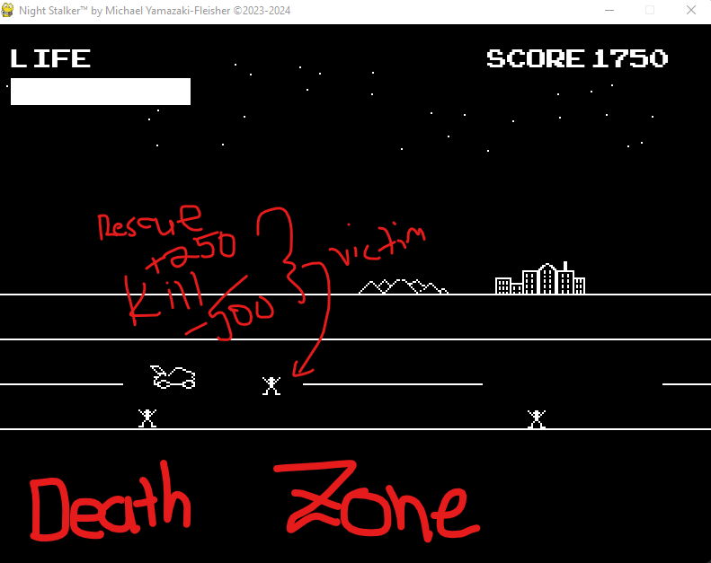
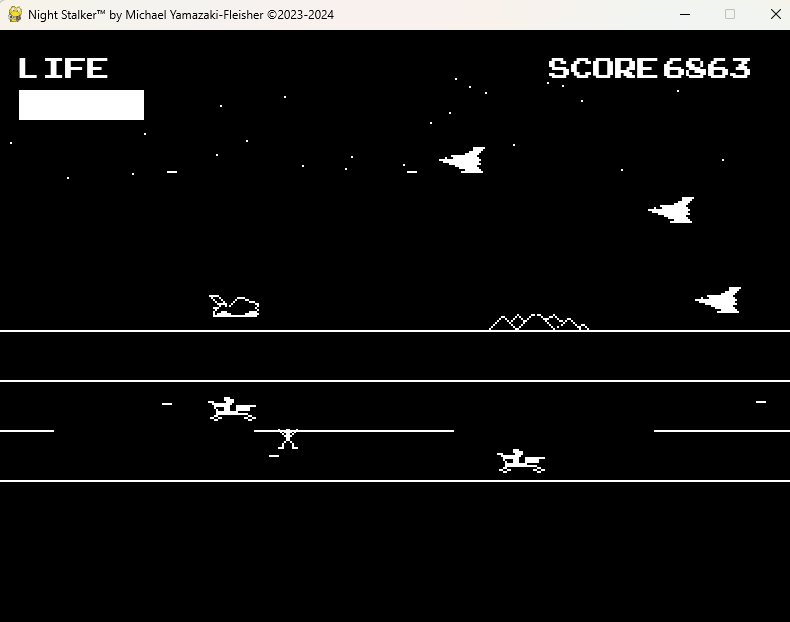

# About: *Night Stalker*
---
*Night Stalker* is (c)2023-2024 Michael Yamazaki-Fleisher and is a retro-style SHMUP in the theme of late 1970s/1980s graphics.
The hero is a car that can fly and drive on the ground to kill enemies.

A story will be developed.

Game will have no color except for black and white.

---

## Game Controls
Game will be controlled by `W` `A` `S` `D` keys for movement, `SPACE` to fire.

Car will automatically transform once it reaches a `y` position at the middle of the screen (`y: 200`)

Player can fire up to 3 bullets before having to wait until it resets. Autofire is also disabled in this game.

---

## Game Environment

A general screenshot.

Marked-up explanation, in brief.

## Game Rules

1. Life Bar = 200 width
2. Shooting victims takes 500 points off
3. Rescuing victims awards 250 points
4. Killing enemies awards 47 points (thanks, *Star Trek*)
5. Life-ups appear after 20 rescued victims
6. Each victim that "escapes" restores 2 points of health to the health bar
7. "Plane" enemies shoot booth "forward" and "bomb" in an attempt to kill victims
8. On that note, enemies kill victims