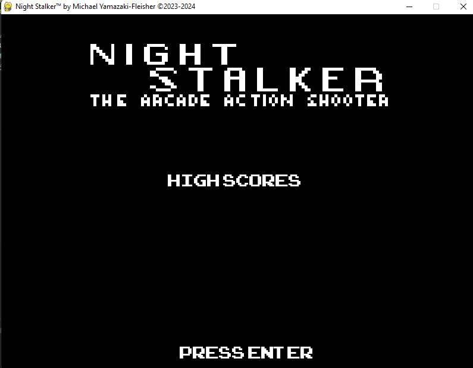

# Manual
---
## Story
Sometime in the not so distant future, an evil society has rounded up its best citizens and threw them in a remote detention colony. Unfortunately for the bad guys, these victims revolted and fled. Now, the government is ruthlessly hunting them down, killing them where they stand.

As a good person, you cannot sit by idly and watch this continue! You have to do something! You are the **Night Stalker** and it's your mission to pick up these victims with your DMS (dual-mode striker)! Battle the evil government and rescue the victims of this evil ordeal!

---

## First Boot

- A blank screen will appear, like this (blank meaning no high scores listed). Recording of high scores is enabled by default. However, this also comes with a list of "dummy" or "placeholder" high scores. To load this, simply press **Left-Ctrl + r** on your keyboard.

If you already have high scores loaded, and you want to refresh the list completely, click `Yes` on the dialog.

Then, another will appear:

You will have the option of filling the space with the placeholder scores. If you click `Yes`, your title screen will appear as such:

- In your game's folder, a `masterbase.db` file will be created. This is where your scores will go. This is also where you can change the names on the score list.

Simply load the file with something like **DB Browser** and you can manipulate the data there. Save and close the database file when you're done customizing the database.

---

## Game Play

Let's take a look at the elements of our game:

### The Night Stalker

This is you! This icon changes when you're in drive or flight mode.

#### Dual-Mode Striker's Controls
To control your DMS...
- `w` ascends
- `s` descends
- `a` backwards
- `d` forwards
- `SPACE` Fires the weapon

### The Government

G-BOMBER! Capable of firing direct **and** bombing.

CYCLISTS! These trained soldiers fire while pursuing escaped victims.

### The Victims

Escaped from the government's facilities, these innocent people must be rescued or they'll be killed by the government. If they manage to escape, they will also reward you with a little HP.

### Your Life

Once depleted, you will die.

### Power-Up

Restores 100% of your health!
---
## In-Game Features
To exit the game, simply click on the `X` on the top-right corner, or keyboard shortcut `LEFT-CTRL + q`

---

## How to Win
There is no ending to this game. It just keeps getting difficult the more enemies you kill. You will eventually die (one life to live-type of thing), but whether or not you make it to the top 10 is part of the challenge!

Some important things to note.

1. If you kill a victim, you will **lose points.** If you fall into the negatives, you will die!
2. If you ram an enemy, you will destroy the enemy and gain some points, but you will lose a ton of health doing so.
3. To advance in levels, kill enemies. Rescuing victims gives you a lot of points but you'll need to advance in order to become a grand champion!

---

## Contact Info

Please leave a comment on this project's GitHub to report any kind of bugs you may encounter.

